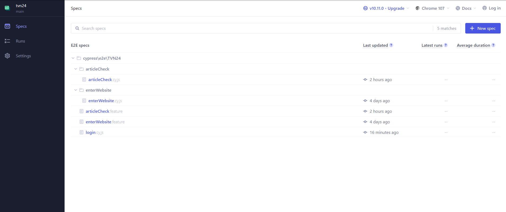

# TVN24 - Zadanie

In this repository you can find the test of entering the website, opening an article, manipulating the video player and logging in

## Before running the test:

* Installation of Node.js 
Installation from the website https://nodejs.org/en

* Installation of Cypress
    $ npm install cypress

* Installation of Cucumber - You can run the tests without it

    $ npm install -D @badeball/cypress-cucumber-preprocessor
    
    $ npm install -D @esbuild-plugins/node-modules-polyfill

More information: https://testersdock.com/cypress-cucumber-bdd/

## Launching tests:

$ npx cypress open

The above command will launch the main Cypress window. You should choose E2E testing
After selecting E2E, a list of tests will appear, the same as in the picture below.

Files with the .feature extension open tests written with Cucumber
The cy.js file opens a regular test